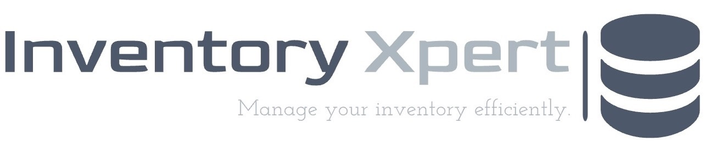

# Inventory Xpert



## Overview

Welcome to Inventory Xpert, a cutting-edge web application developed for the Non-Relational Database Development coursework (COM517) at Ulster University (2023/24). This powerful application seamlessly integrates a Next.js frontend, Flask backend, and MongoDB database, offering an unparalleled inventory management system.

## Description

Inventory Xpert is built upon an IKEA dataset, providing a comprehensive inventory of products, customer information, and order details. It empowers you to efficiently track, manage, and analyze stock and customer interactions with ease.

## Tech Stack

### Frontend

- **Next.js:** A versatile framework for building React applications.
- **React:** A powerful JavaScript library for constructing user interfaces.
- **Tailwind CSS:** A utility-first CSS framework for flexible and rapid styling.

### Backend

- **Flask:** A Python web framework for building APIs.
- **MongoDB:** A NoSQL database for storing data.
- **PyMongo:** MongoDB driver for Python.

### Development Tools

- **Concurrently:** Run Next.js and Flask servers simultaneously.
- **Axios:** HTTP client for making API requests.
- **JsonWebToken (JWT):** Secure user authentication.
- **Pytest:** Testing framework for Python.
- **Eslint:** Linting utility for code consistency.

## Functionality

### NoSQL Queries

The backend supports a range of NoSQL queries, enabling efficient interaction with the IKEA dataset. Key functionalities include selecting necessary fields, matching values in arrays, text searches, and advanced operations like data transformations and map-reduce.

### Authentication

User login is secured using JSON Web Tokens (JWT), ensuring stateless and secure authentication.

### Testing

[](https://github.com/vaibhavthapliyalx/inventory_xpert/actions/workflows/backend_pipeline.yml)

The application includes comprehensive testing using Pytest to guarantee the reliability and correctness of the application's functionalities. The testing status can be checked using the badge above.

## How to Run Locally

1. Clone the repository:

    ```bash
    git clone https://github.com/your-username/inventory_xpert.git
    cd inventory-xpert
    ```

2. Install dependencies for both frontend and backend:

    ```bash
    npm install
    cd api && pip install -r requirements.txt
    ```

3. Run both servers concurrently:

    ```bash
    npm run dev
    ```

Visit [http://localhost:3000](http://localhost:3000) to explore the application.

## Deployment

Inventory Xpert is hosted on Vercel. Visit [Inventory Xpert on Vercel](https://inventory-xpert.vercel.app/login) to experience the live application.

## Disclaimer

This project, named Inventory Xpert, is intended for reference purposes only. It is not to be copied, and all code belongs to the original author. No warranty is provided, and it is solely for educational and reference purposes.

Feel free to customize or enhance the README as needed.
